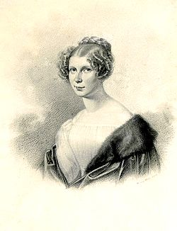

<html>
    <head>
<link rel="stylesheet" href="teleki css.css">
    </head>
    <body>
        <h1>Teleki Blanka</h1>
         
        <h2>Széki gróf Teleki Blanka /Kővárhosszúfalu, 1806. július 3. – Párizs, 1862. október 23./  
            a magyar nőnevelés egyik úttörője, a nők művelődési egyenjogúságának híve. 

        </h2>
<ul>

    <li>Életpályája</li>
    <li>Emlékezete</li>
    <li>A nevét viselő iskolák, kollégiumok Magyarországon</li>
</ul>

<h3>
    
</h3>

<h4>
    
Életpályája

     
    
Az erdélyi arisztokrata gróf széki Teleki családban, Nagybánya közelében született. Édesapja Teleki Imre /1782-1848/, édesanyja pedig korompai gróf Brunszvik Karolina /1782–1843/, az első magyarországi óvodák megalapítójának, gróf Brunszvik Teréznek a húga volt. Két ifjabb testvére: Teleki Emma {De Gerando Ágost neje} 1809-ben, Miksa 1813-ban született.    
        Fiatalon Münchenben és Párizsban festészetet, Budán Ferenczy Istvánnál szobrászatot tanult. Későbbi pályájára a legnagyobb hatással mégis nagynénje, Brunszvik Teréz volt, aki magával vitte külföldi utazásaira. Blanka is a nőnevelést választotta hivatásául: 1846-ban magyar tanítási nyelvű leánynevelő intézetet nyitott Pesten, a mai Szabadság téren. Ez az iskola számít az első olyan magyarországi leányiskolának, ahol szakszerű oktatás folyt. A kiváló tanárok között volt Vasvári Pál (történelem), Hanák János (természetrajz) és Leövey Klára (nevelőnő). A szabadságharc alatt, 1848 végén kénytelen volt az intézetet bezárni; Leövey Klárával előbb Debrecenbe, Nagyváradra, végül Szegedre menekült. A szabadságharc bukása után részt vett a hadbíróság elől bújdosó forradalmárok rejtegetésében. Pálfalvára (Szatmárpálfalva), az egyik Teleki-kúriára vonult vissza. A település szinte megközelíthetetlen volt, ezért az üldözöttek nagy számban menekültek ide. Párizsban élő nővérén keresztül kapcsolatot tartott a magyar emigrációval és miután a bécsi rendőrség kezére jutott a levelezése, 1851-ben Bécsben elfogták, és Pestre, az Újépületbe szállították.Teleki Sándor honvédtiszt így emlékezett erre az eseményre: „Teleki Blankát elfogták, sok mindennel vádolták, ágyukat, a szent István koronáját és palástját keresték házában, ásattak a pálfalvi kertben, s különösen azzal gyanusiták, hogy ezrekben küldi ki a pénzt külföldre az emigránsoknak. Kötél és ón terhe alatt volt tiltva velünk, politikai bélpoklosokkal, érintkezni.”1853-ban a haditörvényszék 10 évi várfogságra ítélte; az ítéletet is az Újépületben hirdették ki. Teleki Blanka Brünnben, Olmützben és végül Kufsteinben raboskodott.  
         Miután 1857. május 11-én amnesztiával szabadult a kufsteini börtönből, többé nem tért haza. Ausztriában, majd Franciaországban élt, a húgánál. Ekkor a menekültek ügyét karolta fel. Párizsban érte a halál. A Montparnasse-i temetőben helyezték nyugalomra.

</h4>

<h5>
    
Emlékezete

     
    <ul id="elete-szoveg">
        <li>Teleki Blanka-díj</li>
        <li>2006. október 11-én a Párizsi Magyar Intézet emléktáblát helyezett el Teleki Blanka grófnő és testvére, Emma egykori lakhelyén, a Vaugirard utca 37. szám alatt álló párizsi épület homlokzatán. 
        </li>
        <li>A Montparnasse-i temetőben nyugszik.
        </li>
    </ul>
</h5>

<h6>
    
A nevét viselő iskolák, kollégiumok Magyarországon

     
    <table>

      <tr>
        <td></td>
        <td></td>
      </tr>

      <tr>
        <td></td>
        <td></td>
      </tr>

      <tr>
        <td></td>
        <td></td>
      </tr>

      <tr>
        <td></td>
        <td></td>
      </tr>

      <tr>
        <td></td>
        <td></td>
      </tr>

      <tr>
        <td></td>
        <td></td>
      </tr>

      <tr>
        <td></td>
        <td></td>
      </tr>

      <tr>
        <td></td>
        <td></td>
      </tr>

      <tr>
        <td></td>
        <td></td>
      </tr>

      <tr>
        <td></td>
        <td></td>
      </tr>

      <tr>
        <td></td>
        <td></td>
      </tr>

      

    </table>
</h6>

    </body>
</html>
